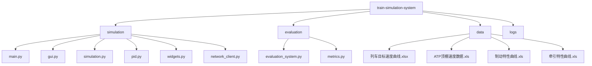

# 🚄 列车驾驶仿真与评价系统


<div align="center">

**一个列车驾驶仿真与实时评价系统**

[功能特点](#-功能特点) •
[快速开始](#-快速开始) •
[使用指南](#-使用指南) •
[技术文档](#-技术文档) •
[开发团队](#-开发团队) 

</div>

---

## 📑 项目概述

这是一个集成了驾驶仿真和实时评价的完整列车操作系统。通过实时TCP网络通信，系统可以对驾驶员的操作进行即时评估，同时支持离线数据分析和评价报告生成。

### 🌟 亮点功能
- 💻 实时仿真与评价联动
- 🔄 自动/手动驾驶模式切换
- 📊 动态数据可视化
- 📝 智能评价生成
- 🔍 详细的运行日志记录

## 🚀 功能特点

<table>
<tr>
<td>

### 🎮 驾驶仿真系统

- ⚙️ 真实的列车动力学模型
- 🔄 人工/自动驾驶模式切换
- ⏱️ 1-10倍速仿真调节
- 📈 实时速度-位置曲线
- 🎯 现代风格仪表盘界面
- 📝 完整日志记录系统

</td>
<td>

### ⚖️ 驾驶评价系统

- 📊 实时数据评价
  - 🎯 超调量分析
  - 😊 舒适度评估
  - ⏰ 准点率计算
  - 📏 停车误差测量
- 📋 离线数据分析
- 📑 评价报告生成

</td>
</tr>
</table>

## 💻 系统要求

### 必需环境
```
Python >= 3.7
PyQt5
pandas
numpy
matplotlib
scipy
```

## ⚡ 快速开始

### 📥 安装步骤

1️⃣ **克隆项目仓库**
```bash
git clone [repository-url]
cd train-simulation-system
```

2️⃣ **创建虚拟环境**
```bash
# 创建环境
python -m venv venv

# 激活环境
## Windows
venv\Scripts\activate
## Linux/Mac
source venv/bin/activate
```

3️⃣ **安装依赖**
```bash
pip install -r requirements.txt
```

## 🎮 使用指南

### 🔌 启动系统

1️⃣ **启动评价系统**
```bash
python evaluation.py
```

2️⃣ **启动仿真系统**
```bash
python main.py
```

### ⌨️ 快捷键操作

<table>
<tr><th>按键</th><th>功能</th></tr>
<tr><td><kbd>Q</kbd></td><td>切换至牵引工况</td></tr>
<tr><td><kbd>W</kbd></td><td>切换至惰行工况</td></tr>
<tr><td><kbd>E</kbd></td><td>切换至制动工况</td></tr>
<tr><td><kbd>O</kbd></td><td>增加当前工况力度</td></tr>
<tr><td><kbd>P</kbd></td><td>减小当前工况力度</td></tr>
</table>

### 仿真输出文件

最后一次仿真结束时，将生成三个文件：
- 一个是🖼️ PNG文件，记录了最后的速度曲线图。
- 一个是📜 LOG文件，记录了整个仿真过程的操作。
- 一个是📊 CSV文件，记录了仿真过程的具体数据。


## 📊 评价指标

### 🎯 超调量
> **定义**: 实际速度超过目标速度的百分比  
> **公式**: `overshoot = (actual_speed - target_speed) / target_speed * 100`

### 😊 舒适度等级
| 等级 | 加速度范围 | 描述 |
|:----:|:----------:|:----:|
| 🟢 | ≤ 0.28 m/s² | 极舒适 |
| 🟡 | 0.28 ~ 1.23 m/s² | 舒适 |
| 🟠 | 1.23 ~ 2.12 m/s² | 不舒适 |
| 🔴 | > 2.12 m/s² | 无法忍受 |

### ⏱️ 准点率
> **标准**: 允许偏差 ±180秒（3分钟）

### 📏 停车误差
> **计算**: `error = |actual_position - target_position|`

## 📁 项目结构



## ⚠️ 注意事项

- 🔵 评价系统必须先于仿真系统启动
- 🔵 确保所有数据文件完整
- 🔵 日志自动保存在logs目录
- 🔵 支持CSV格式数据导出

## 🛠️ 故障排除

<details>
<summary>💥 系统无法启动</summary>

- ✅ 检查Python版本 (>= 3.7)
- ✅ 验证依赖安装情况
- ✅ 确认数据文件完整性
</details>

<details>
<summary>🌐 网络连接失败</summary>

- ✅ 确认评价系统已启动
- ✅ 检查端口5000占用情况
- ✅ 查看防火墙设置
</details>

## 👥 开发团队

### 开发者
- 🎓 **罗晨凯** - 2021级交通工程信控系，同济大学
  - 📧 Email: 2151216@tongji.edu.cn
  - 🔗 GitHub: [ryan11njr](https://github.com/ryan11njr)

- 🎓 **胡家晗** - 2021级交通工程交规系，同济大学
- 🎓 **陈彦宇** - 2021级交通工程交规系，同济大学

## 📜 许可证

本项目采用 [MIT](LICENSE) 许可证。

---

<div align="center">
<strong>Made with ❤️ by TongJi University</strong>
</div>
